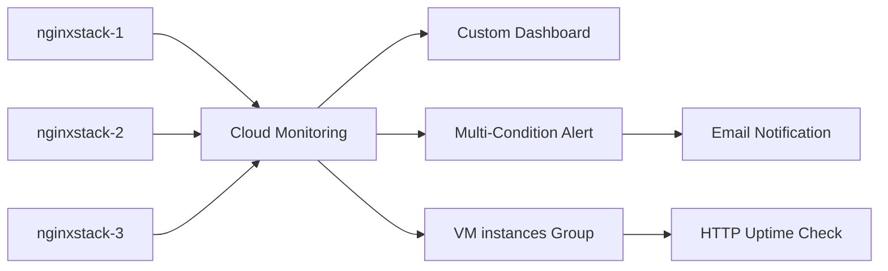
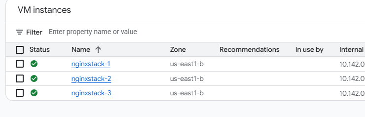
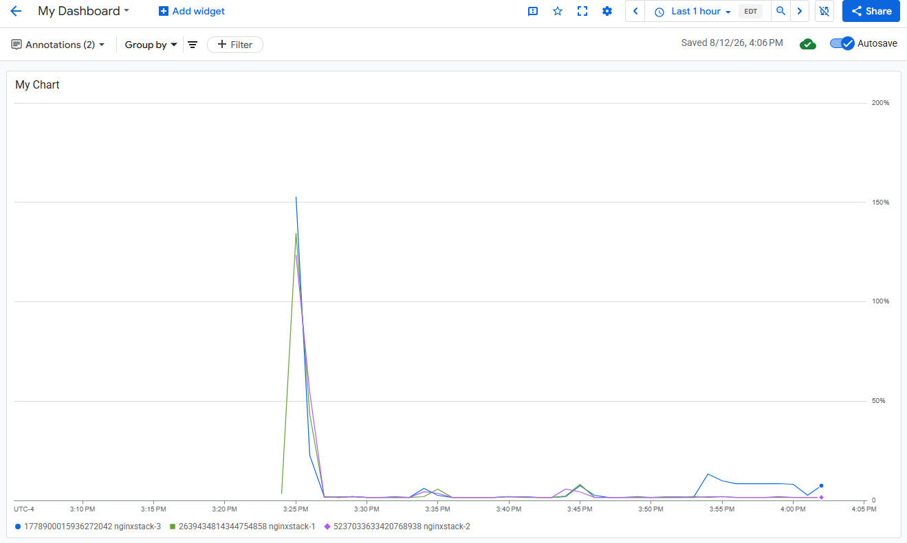
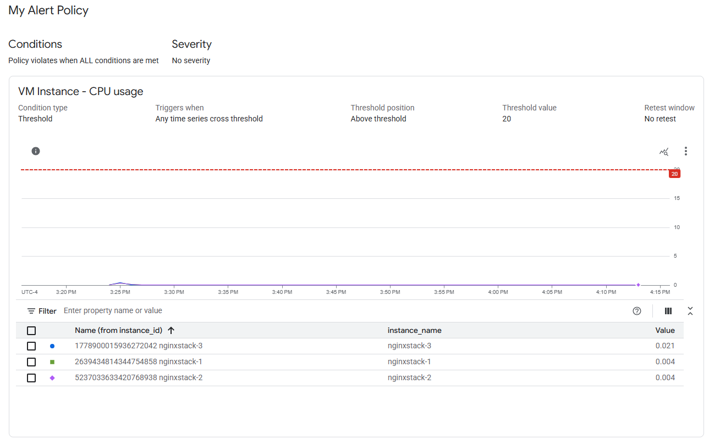
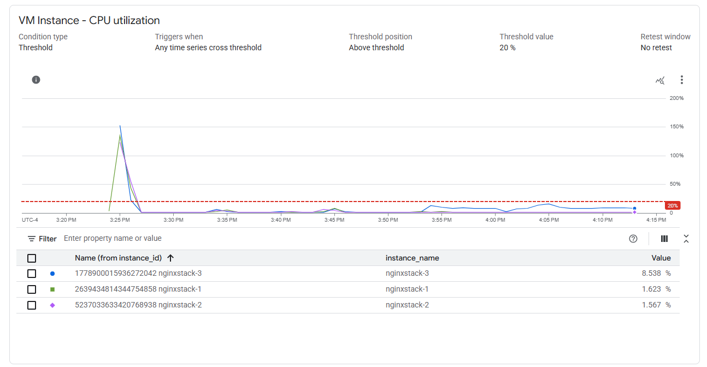
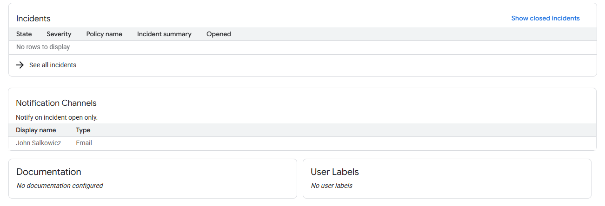
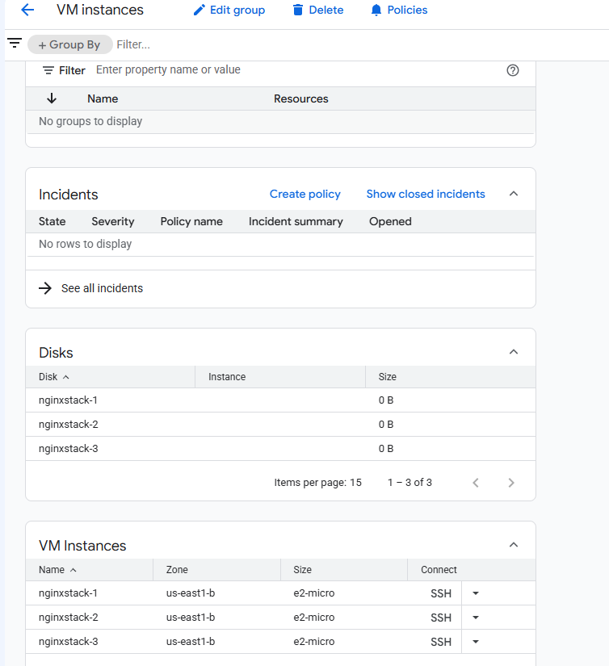
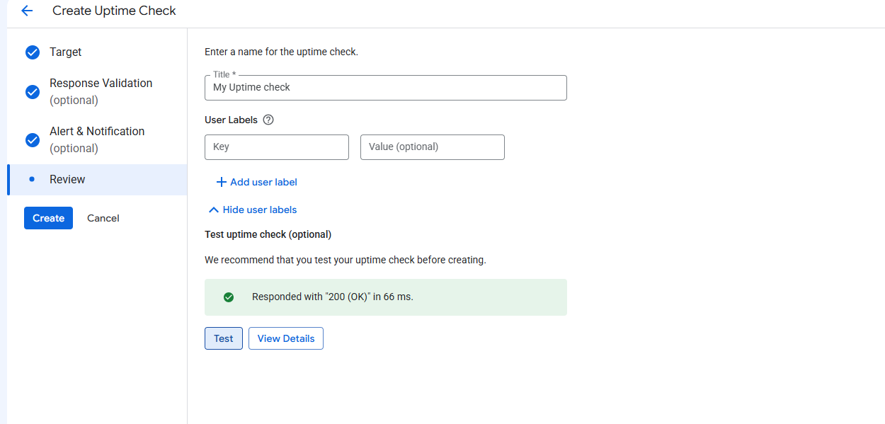
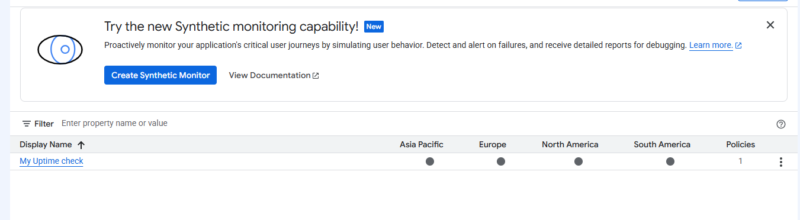

# Monitor Resources with Google Cloud Observability

Hands-on Google Cloud lab where I monitored Compute Engine VMs, built a dashboard, created a two-condition alert, grouped related resources, and set up an HTTP uptime check.

> **Note:** This was a Google Cloud Skills Boost training lab. It was done for hands-on practice and is not a production environment.

## What I Practiced

- Checking which Compute Engine VMs were in scope for monitoring
- Building a custom Cloud Monitoring dashboard
- Comparing CPU utilization across multiple VMs
- Creating an alert with two CPU-related conditions
- Adding an email notification channel
- Grouping related VMs together
- Testing service availability with an HTTP uptime check
- Disabling an alert policy after the lab

## Lab Flow

---

## 1. Verify the VMs

I started by checking the VM Instances page to make sure the three lab VMs were running:

- `nginxstack-1`
- `nginxstack-2`
- `nginxstack-3`

All three were running in `us-east1-b` and had internal and external IP addresses.

### What I Learned

The VMs did not have to be created from inside Cloud Monitoring. They were already available to monitor once they were running in the project.

### Why It Mattered

Before setting up dashboards or alerts, I needed to know which systems I was actually monitoring. If something is left out of monitoring, problems with it can be easy to miss.

---

## 2. Build a Custom Dashboard

I created `My Dashboard` and added a line chart called `My Chart` to show CPU utilization for the three VMs.

| Setting | Value |
|---|---|
| Dashboard | `My Dashboard` |
| Widget | Line chart |
| Chart | `My Chart` |
| Resource | VM Instance |
| Metric | CPU utilization |

The chart showed a separate line for each VM, so I could compare their CPU activity over the same time period.

### What I Learned

The dashboard gave me one place to compare the three VMs instead of opening each one separately. It also made spikes and differences between them easier to see.

### Why It Mattered

High CPU by itself does not prove there is a security issue, but an unexpected spike can be a reason to investigate further, especially if it lines up with alerts or logs.

---

## 3. Create a Multi-Condition Alert

I created `My Alert Policy` with two CPU-related conditions and set it so **all conditions had to be met** before the alert could trigger.

### Condition 1 — CPU Usage

| Setting | Value |
|---|---|
| Resource | VM Instance |
| Metric | CPU usage |
| Rolling window | 1 minute |
| Threshold position | Above threshold |
| Threshold value | `20` |

### Condition 2 — CPU Utilization

| Setting | Value |
|---|---|
| Resource | VM Instance |
| Metric | CPU utilization |
| Rolling window | 1 minute |
| Threshold position | Above threshold |
| Threshold value | `20%` |
| Trigger logic | All conditions are met |

I also added an email notification channel.

### What I Learned

An alert can use more than one condition. In this case, Cloud Monitoring checked both CPU conditions instead of firing from a single metric by itself.

### Why It Mattered

Using more than one condition can make an alert more specific and help cut down on unnecessary notifications.

---

## 4. Group Related Resources

I created a Cloud Monitoring group called `VM instances` and used `nginx` as the filter.

That pulled in:

- `nginxstack-1`
- `nginxstack-2`
- `nginxstack-3`

### What I Learned

The group gave me one place to look at related resources instead of treating each VM as a completely separate monitoring target.

### Why It Mattered

If several systems belong to the same application, looking at them together can make it easier to notice when more than one of them is having the same problem.

---

## 5. Create an HTTP Uptime Check

I created an uptime check for the `VM instances` group to see whether the NGINX resources were reachable over HTTP.

| Setting | Value |
|---|---|
| Protocol | HTTP |
| Resource type | Instance |
| Applies to | Group |
| Group | `VM instances` |
| Check frequency | 1 minute |
| Notification channel | Email |
| Uptime check | `My Uptime check` |

Before saving it, I ran the built-in test. Cloud Monitoring reached the target successfully and returned `200 OK`.

After I created it, `My Uptime check` appeared on the Uptime Checks page.

### What I Learned

Watching CPU tells me how a VM is behaving. An uptime check answers a different question: can the service actually be reached?

### Why It Mattered

A VM can look normal from a CPU or memory perspective while the application is still unavailable. The uptime check gave me another way to catch that kind of problem.

---

## 6. Disable the Alert

At the end of the lab, I turned off `My Alert Policy`.

The policy stayed in Cloud Monitoring, but it stopped evaluating the CPU conditions and sending notifications.

### What I Learned

I could disable an alert without deleting it. That keeps the configuration available if it needs to be used again.

### Why It Mattered

Old alerts can become noise. Turning off ones that are no longer needed makes it easier to trust the alerts that are still active.

> **Evidence note:** I did not save a separate screenshot of the disabled policy. I disabled it as part of the lab cleanup.

---

## Key Takeaways

- Existing Compute Engine VMs can be monitored without recreating them in Cloud Monitoring.
- A dashboard makes it easier to compare several systems at once.
- CPU metrics can point to behavior worth investigating, but they need context.
- Alerts can use more than one condition.
- Requiring multiple conditions can help reduce unnecessary notifications.
- Resource groups make related systems easier to monitor together.
- Uptime checks verify that a service is actually reachable.
- Alert policies need cleanup and maintenance just like the systems they monitor.

## Tools and Technologies

`Google Cloud` · `Cloud Monitoring` · `Compute Engine` · `Dashboards` · `Metrics` · `Alerting` · `Uptime Checks` · `HTTP` · `Resource Groups` · `Notification Channels`

## Detailed Notes

My full task-by-task notes are in [`docs/lab-notes.md`](docs/lab-notes.md).

## Disclaimer

This repository documents a Google Cloud Skills Boost training lab completed for learning and professional development. The resources were temporary and do not represent a production deployment. No employer, customer, or production data is included.
